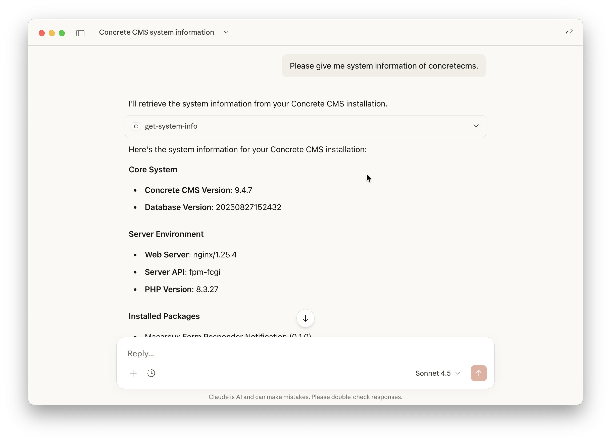

# Concrete CMS MCP Server

A [Model Context Protocol (MCP)](https://modelcontextprotocol.io/) server for [Concrete CMS](https://www.concretecms.org) built with TypeScript.

## Installation

```bash
git clone https://github.com/MacareuxDigital/concretecms-mcp-server.git
cd concretecms-mcp-server
npm install && npm run build
```

## Usage

### Enable API in Concrete CMS

Since the MCP server uses the Concrete CMS API, you need to enable it in your Concrete CMS installation first.
Please refer to the [Concrete CMS documentation](https://documentation.concretecms.org/9-x/developers/rest-api/introduction) for more information.

### Connect your LLM to the local Concrete CMS MCP Server

Here's an example configuration for Claude Desktop:

```json
{
  "mcpServers": {
    "concretecms": {
      "command": "node",
      "args": [
        "/path/to/concretecms-mcp-server/dist/index.js"
      ],
      "env": {
        "CONCRETE_CANONICAL_URL": "https://your-concrete.example",
        "CONCRETE_API_CLIENT_ID": "YOUR_API_CLIENT_ID",
        "CONCRETE_API_CLIENT_SECRET": "YOUR_API_CLIENT_SECRET",
        "CONCRETE_API_SCOPE": "account:read system:info:read"
      }
    }
  }
}
```

- Set `CONCRETE_CANONICAL_URL` to the URL of your Concrete CMS installation.
- Set `CONCRETE_API_CLIENT_ID` and `CONCRETE_API_CLIENT_SECRET` to the credentials of a registered API integration.
- Set `CONCRETE_API_SCOPE` to the scopes you want to request. You can find a list of available scopes from `https://your-concrete.example/index.php/dashboard/system/api/scopes`.

After you've configured the MCP server, please restart Claude Desktop. It'll automatically opens a authorization window, then sign in and authorize the requested scopes.
Now you should be able to get information about your Concrete CMS in a chat. A refresh token will be saved in `.tokens.json` in the `concretecms-mcp-server` directory, so you don't need to sign in again.



For more information about local MCP servers, please refer to the [Claude Desktop documentation](https://modelcontextprotocol.io/docs/develop/connect-local-servers).

### Use your own OpenAPI specification

The MCP server is loading `openapi.yml` to know which endpoints are available in the Concrete CMS API.
The bundled `openapi.yml` file is generated from the Concrete CMS default installation, but you can also use your own OpenAPI specification.
If you added some Express Objects to your Concrete CMS installation and want to use them in your chat, you can generate a new OpenAPI specification from your installation and use it instead.

1. Check "Include this entity in REST API integrations." in the Express Object settings.
2. Open `https://your-concrete.example/index.php/ccm/system/api/openapi.json` in your browser, and copy the JSON output.
3. Replace the `openapi.yml` file in the `concretecms-mcp-server` directory with your own OpenAPI specification.

## Features

This MCP server is depended on the Concrete CMS API, so it supports all features that are available through the API.
For example:

- Get information about your Concrete CMS installation.
- Get content from your Concrete CMS installation.
- Update content in your Concrete CMS installation.
- Upload files to your Concrete CMS installation.
- Get a list of users in your Concrete CMS installation.
- And more!

You can find a list of all available endpoints in [Concrete CMS REST API - Endpoints](https://documentation.concretecms.org/9-x/developers/rest-api/concrete-cms-rest-api-endpoints)

## ToDos

- Test with other MCP clients.
- Support another authentication method than OAuth2.
- Support to build a remote MCP server (Streamable HTTP Transport).

## License

MIT
