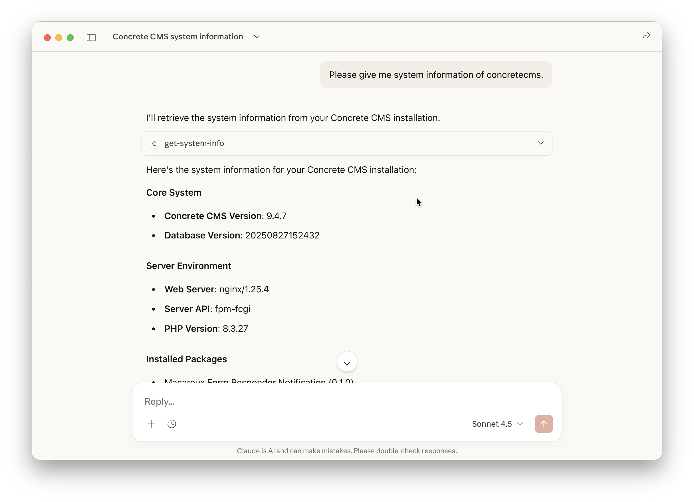

# Concrete CMS MCP Server

A [Model Context Protocol (MCP)](https://modelcontextprotocol.io/) server for [Concrete CMS](https://www.concretecms.org) built with TypeScript.

## Installation

```bash
git clone https://github.com/MacareuxDigital/concretecms-mcp-server.git
cd concretecms-mcp-server
npm ci && npm run build
```

## Usage

### Enable API in Concrete CMS

Since the MCP server uses the Concrete CMS API, you need to enable it in your Concrete CMS installation first.
Please refer to the [Concrete CMS documentation](https://documentation.concretecms.org/9-x/developers/rest-api/introduction) for more information.

### Connect your LLM to the local Concrete CMS MCP Server

Here's an example configuration for Claude Desktop:

```json
{
  "mcpServers": {
    "concretecms": {
      "command": "node",
      "args": [
        "/path/to/concretecms-mcp-server/dist/index.js"
      ],
      "env": {
        "CONCRETE_CANONICAL_URL": "https://your-concrete.example",
        "CONCRETE_API_CLIENT_ID": "YOUR_API_CLIENT_ID",
        "CONCRETE_API_CLIENT_SECRET": "YOUR_API_CLIENT_SECRET",
        "CONCRETE_API_SCOPE": "account:read system:info:read"
      }
    }
  }
}
```

- Set `CONCRETE_CANONICAL_URL` to the URL of your Concrete CMS installation.
- Set `CONCRETE_API_CLIENT_ID` and `CONCRETE_API_CLIENT_SECRET` to the credentials of a registered API integration.
- Set `CONCRETE_API_SCOPE` to the scopes you want to request. You can find a list of available scopes from `https://your-concrete.example/index.php/dashboard/system/api/scopes`.

After you've configured the MCP server, please restart Claude Desktop. It'll automatically opens an authorization window, then sign in and authorize the requested scopes.
Now you should be able to get information about your Concrete CMS in a chat. A refresh token will be saved in `.tokens.json` in the `concretecms-mcp-server` directory, so you don't need to sign in again.



For more information about local MCP servers, please refer to the [Claude Desktop documentation](https://modelcontextprotocol.io/docs/develop/connect-local-servers).

### Run as a remote MCP server

Use remote mode when an AI agent in the Concrete CMS dashboard (or another remote client) needs to connect over HTTP instead of spawning a local stdio process.

#### Environment variables

| Variable | Required | Default | Description |
|----------|----------|---------|-------------|
| `TRANSPORT_TYPE` | No | `stdio` | Set to `http` for remote mode |
| `PUBLIC_BASE_URL` | Yes (http mode) | — | Public URL of this server, e.g. `https://your-concrete.example` |
| `PATH_PREFIX` | No | _(empty)_ | Path prefix for all routes, e.g. `/ccm-mcp` |
| `HTTP_HOST` | No | `0.0.0.0` | Bind address |
| `HTTP_PORT` | No | `3000` | Listen port |
| `MCP_ENDPOINT_PATH` | No | `{PATH_PREFIX}/mcp` | Streamable HTTP MCP endpoint |
| `OAUTH_START_PATH` | No | `{PATH_PREFIX}/oauth/start` | OAuth initiation path |
| `OAUTH_CALLBACK_PATH` | No | `{PATH_PREFIX}/oauth/callback` | OAuth redirect path |
| `OAUTH_STATUS_PATH` | No | `{PATH_PREFIX}/oauth/status` | OAuth status path |
| `HEALTH_PATH` | No | `{PATH_PREFIX}/health` | Health check path |
| `TOKEN_FILE` | No | `.tokens.json` | Token storage path (use a volume in containers) |

All `CONCRETE_*` variables from the local setup are still required.

#### Concrete CMS OAuth setup

Register this redirect URI in your Concrete CMS API integration:

```
https://mcp.your-concrete.example/oauth/callback
```

Use the same value as `${PUBLIC_BASE_URL}${OAUTH_CALLBACK_PATH}`.

#### Same domain (no subdomain)

You can run the MCP server on the same domain as Concrete CMS by setting a path prefix. This avoids conflicts with CMS routes such as `/oauth/2.0/authorize`.

```bash
TRANSPORT_TYPE=http \
PUBLIC_BASE_URL=https://your-concrete.example \
PATH_PREFIX=/ccm-mcp \
CONCRETE_CANONICAL_URL=https://your-concrete.example \
...
```

With `PATH_PREFIX=/ccm-mcp`, the routes become:

- MCP endpoint: `https://your-concrete.example/ccm-mcp/mcp`
- OAuth start: `https://your-concrete.example/ccm-mcp/oauth/start`
- OAuth callback: `https://your-concrete.example/ccm-mcp/oauth/callback`

Register the callback URL in your Concrete CMS API integration:

```
https://your-concrete.example/ccm-mcp/oauth/callback
```

Individual path env vars (`MCP_ENDPOINT_PATH`, `OAUTH_START_PATH`, etc.) can override the defaults if needed.

#### Start the server

```bash
TRANSPORT_TYPE=http \
PUBLIC_BASE_URL=https://mcp.your-concrete.example \
CONCRETE_CANONICAL_URL=https://your-concrete.example \
CONCRETE_API_CLIENT_ID=YOUR_API_CLIENT_ID \
CONCRETE_API_CLIENT_SECRET=YOUR_API_CLIENT_SECRET \
CONCRETE_API_SCOPE="account:read system:info:read" \
npm start
```

#### Authorize

1. Open `https://mcp.your-concrete.example/oauth/start` in a browser.
2. Sign in to Concrete CMS and approve the requested scopes.
3. Check status at `GET /oauth/status`:

```json
{ "authenticated": true, "expiresAt": 1710000000000 }
```

#### Connect a remote MCP client

Remote clients connect to the Streamable HTTP endpoint:

```
POST https://mcp.your-concrete.example/mcp
```

Example initialize request:

```bash
curl -X POST https://mcp.your-concrete.example/mcp \
  -H "Content-Type: application/json" \
  -H "Accept: application/json, text/event-stream" \
  -d '{"jsonrpc":"2.0","id":1,"method":"initialize","params":{"protocolVersion":"2025-03-26","capabilities":{},"clientInfo":{"name":"test","version":"1.0.0"}}}'
```

#### Docker deployment

Copy `.env.example` to `.env`, fill in your values, then run:

```bash
docker compose up -d --build
```

Tokens are persisted in the `mcp-tokens` Docker volume.

#### Reverse proxy example (nginx)

Run the MCP server behind HTTPS in production. When using `PATH_PREFIX=/ccm-mcp`:

```nginx
location /ccm-mcp/mcp {
  proxy_pass http://127.0.0.1:3000;
  proxy_http_version 1.1;
  proxy_set_header Host $host;
  proxy_buffering off;
}

location /ccm-mcp/oauth/ {
  proxy_pass http://127.0.0.1:3000;
}

location /ccm-mcp/health {
  proxy_pass http://127.0.0.1:3000;
}
```

Without a path prefix:

```nginx
location /mcp {
  proxy_pass http://127.0.0.1:3000;
  proxy_http_version 1.1;
  proxy_set_header Host $host;
  proxy_buffering off;
}

location = /oauth/start {
  proxy_pass http://127.0.0.1:3000;
}

location = /oauth/callback {
  proxy_pass http://127.0.0.1:3000;
}

location = /oauth/status {
  proxy_pass http://127.0.0.1:3000;
}

location = /health {
  proxy_pass http://127.0.0.1:3000;
}
```

Do not proxy the entire `/oauth/` prefix to the MCP server when sharing a domain with Concrete CMS, because CMS uses `/oauth/2.0/*` for its own OAuth endpoints.

### Use your own OpenAPI specification

The MCP server is loading `openapi.yml` to know which endpoints are available in the Concrete CMS API.
The bundled `openapi.yml` file is generated from the Concrete CMS default installation, but you can also use your own OpenAPI specification.
If you added some Express Objects to your Concrete CMS installation and want to use them in your chat, you can generate a new OpenAPI specification from your installation and use it instead.

1. Check "Include this entity in REST API integrations." in the Express Object settings.
2. Open `https://your-concrete.example/index.php/ccm/system/api/openapi.json` in your browser, and copy the JSON output.
3. Replace the `openapi.yml` file in the `concretecms-mcp-server` directory with your own OpenAPI specification.

## Features

This MCP server is depended on the Concrete CMS API, so it supports all features that are available through the API.
For example:

- Get information about your Concrete CMS installation.
- Get content from your Concrete CMS installation.
- Update content in your Concrete CMS installation.
- Upload files to your Concrete CMS installation.
- Get a list of users in your Concrete CMS installation.
- And more!

You can find a list of all available endpoints in [Concrete CMS REST API - Endpoints](https://documentation.concretecms.org/9-x/developers/rest-api/concrete-cms-rest-api-endpoints)

## ToDos

- Test with other MCP clients.
- Add useful prompts.
- Support another authentication method than OAuth2.

## License

MIT
