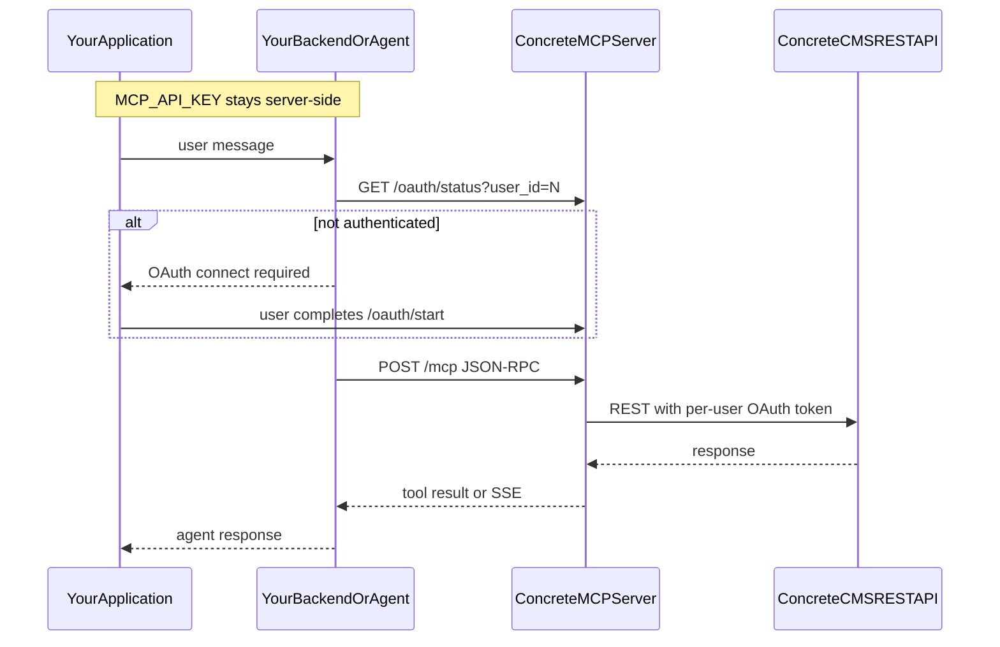

# Building an MCP Client for Concrete CMS

This guide is for **developers** building an MCP client or AI agent that connects to a remote Concrete CMS MCP server over HTTP.

It covers the HTTP API, per-user OAuth, MCP protocol usage, implementation patterns, and agent loops. It does not cover MCP server deployment (see the [Remote MCP Server Guide](remote-server.md)) or end-user desktop app configuration (see the [main README](../README.md)).

## Who this is for

- Developers building a **backend agent service** (Node, Python, PHP, etc.)
- Developers building a **web application** with an AI chat UI
- Developers building a **Concrete CMS package** with a dashboard chat page
- Anyone implementing a **custom MCP-compatible HTTP client**

## What the MCP server provides

When running in remote mode (`TRANSPORT_TYPE=http`), the server exposes:

- **Streamable HTTP** MCP endpoint at `/mcp` ([MCP spec](https://modelcontextprotocol.io/specification/2025-03-26/basic/transports))
- **Per-user OAuth** admin routes (`/oauth/start`, `/oauth/status`, `/oauth/revoke`)
- **Tools** derived from the Concrete CMS OpenAPI spec (`openapi.yml`) — pages, files, users, system info, and more
- **CMS API execution** using each user's OAuth token; permissions follow that user's CMS scopes

Your application owns the conversation loop. The MCP server owns CMS token storage and tool execution.

## Prerequisites

1. A deployed remote MCP server — [Remote MCP Server Guide](remote-server.md)
2. Reverse proxy routes for `/mcp`, `/oauth/*`, and `/health`
3. A Concrete CMS API integration with redirect URI `${MCP_SERVER_URL}/oauth/callback`
4. `MCP_API_KEY` issued by the server operator (stored server-side in your app only)
5. `CONCRETE_API_SCOPE` on the MCP server must include `account:read`

## Choose your integration pattern

| Pattern | Section |
|---------|---------|
| Backend agent service (Node, Python, PHP bot) | [Backend agent service](#backend-agent-service) |
| Web application with chat UI | [Web application](#web-application-chat-ui--api-backend) |
| Concrete CMS package (dashboard page) | [Concrete CMS package](#concrete-cms-package) |
| Raw HTTP client (any language, no SDK) | [Raw HTTP client](#raw-http-client) |

## Architecture



## HTTP API reference

Set `MCP_SERVER_URL` to the server's public base URL (same as `PUBLIC_BASE_URL`). If the server uses `PATH_PREFIX=/ccm-mcp`, include the prefix in all paths below.

### Endpoints

| Path | Method | Authentication | Purpose |
|------|--------|----------------|---------|
| `/mcp` | POST | API key + user ID | MCP JSON-RPC (tools) |
| `/oauth/start` | GET | API key | Begin per-user OAuth |
| `/oauth/status` | GET | API key | Check if user is authorized |
| `/oauth/revoke` | POST | API key | Revoke user tokens |
| `/oauth/callback` | GET | Public | CMS OAuth redirect (do not call manually) |
| `/health` | GET | Public | Liveness check |

### Headers for `/mcp`

Every MCP request must include:

```
Authorization: Bearer <MCP_API_KEY>
X-Concrete-User-Id: <cms_user_id>
Content-Type: application/json
Accept: application/json, text/event-stream
```

Requests without `Authorization` return `401`. Requests without `X-Concrete-User-Id` return `400`.

### MCP session sequence

1. `initialize` — negotiate protocol version and capabilities
2. `notifications/initialized` — client ready notification
3. `tools/list` — discover available CMS tools
4. `tools/call` — execute a tool during agent conversation

### Example: health check

```bash
curl -s "$MCP_SERVER_URL/health"
```

```json
{"status":"healthy"}
```

### Example: check OAuth status

```bash
curl -s -H "Authorization: Bearer $MCP_API_KEY" \
  "$MCP_SERVER_URL/oauth/status?user_id=42"
```

```json
{"userId":42,"authenticated":true,"expiresAt":1783526622769}
```

### Example: start OAuth (use GET, not HEAD)

`/oauth/start` only handles `GET`. Do not use `curl -I` (HEAD) — it will not reach the handler.

```bash
curl -s -D - -o /dev/null \
  -H "Authorization: Bearer $MCP_API_KEY" \
  "$MCP_SERVER_URL/oauth/start?user_id=42"
```

Expected: `HTTP 302` with `Location:` pointing to the CMS authorize page. Open that URL in a browser; the user signs in and approves scopes.

If another OAuth flow is already running for that user, the server returns `409`:

```json
{"error":"OAuth already in progress for this user"}
```

### Example: revoke a user

```bash
curl -s -X POST -H "Authorization: Bearer $MCP_API_KEY" \
  "$MCP_SERVER_URL/oauth/revoke?user_id=42"
```

```json
{"revoked":true,"userId":42}
```

### Example: MCP initialize

```bash
curl -s -X POST "$MCP_SERVER_URL/mcp" \
  -H "Content-Type: application/json" \
  -H "Accept: application/json, text/event-stream" \
  -H "Authorization: Bearer $MCP_API_KEY" \
  -H "X-Concrete-User-Id: 42" \
  -d '{
    "jsonrpc": "2.0",
    "id": 1,
    "method": "initialize",
    "params": {
      "protocolVersion": "2025-03-26",
      "capabilities": {},
      "clientInfo": {"name": "my-agent", "version": "1.0.0"}
    }
  }'
```

### Example: list tools

```bash
curl -s -X POST "$MCP_SERVER_URL/mcp" \
  -H "Content-Type: application/json" \
  -H "Accept: application/json, text/event-stream" \
  -H "Authorization: Bearer $MCP_API_KEY" \
  -H "X-Concrete-User-Id: 42" \
  -d '{
    "jsonrpc": "2.0",
    "id": 2,
    "method": "tools/list",
    "params": {}
  }'
```

## Per-user OAuth

Each CMS user must authorize separately. Your application must implement this flow:

1. **Resolve `user_id`** — from your web session, app config, or tenant mapping (CMS user IDs are positive integers)
2. **Check status** — `GET /oauth/status?user_id=N`
3. **If not authenticated** — redirect or open `GET /oauth/start?user_id=N` (follow the `Location` header)
4. **User approves** — CMS redirects to `/oauth/callback`; the MCP server stores encrypted tokens
5. **Poll status** — repeat step 2 until `authenticated: true`
6. **Call `/mcp`** — include `X-Concrete-User-Id: N` on every request
7. **On disconnect** (optional) — `POST /oauth/revoke?user_id=N`

The MCP server stores tokens per user under `TOKEN_DIR/<siteKey>/` on the server. Your client never receives CMS refresh tokens directly — only the MCP server uses them when executing tools.

See the [Security Guide](security.md) for the trust model. **`MCP_API_KEY` must live server-side** in your application; never embed it in browser JavaScript.

## Raw HTTP client

You can implement an MCP client in any language using JSON-RPC 2.0 over HTTP POST. No SDK is required.

### Initialize

```json
{
  "jsonrpc": "2.0",
  "id": 1,
  "method": "initialize",
  "params": {
    "protocolVersion": "2025-03-26",
    "capabilities": {},
    "clientInfo": {"name": "my-client", "version": "1.0.0"}
  }
}
```

### Initialized notification

Send as a separate request (no `id` field):

```json
{
  "jsonrpc": "2.0",
  "method": "notifications/initialized"
}
```

### List tools

```json
{
  "jsonrpc": "2.0",
  "id": 2,
  "method": "tools/list",
  "params": {}
}
```

### Call a tool

```json
{
  "jsonrpc": "2.0",
  "id": 3,
  "method": "tools/call",
  "params": {
    "name": "get-system-info",
    "arguments": {}
  }
}
```

Tool names correspond to OpenAPI operations (e.g. `get-system-info`, `get-pages`, `get-account`). Use `tools/list` to discover the exact names and input schemas for your server's `openapi.yml`.

## Backend agent service

Use this pattern for a standalone agent process — a Node service, Python script, LangChain/CrewAI agent, or scheduled job.

### Configuration

Store secrets in environment variables or a secrets manager:

| Variable | Example |
|----------|---------|
| `MCP_SERVER_URL` | `https://mcp.example.com` |
| `MCP_API_KEY` | hex secret from server operator |
| `CMS_USER_ID` | `42` (fixed user) or resolved per job |

### TypeScript / Node

Use the [@modelcontextprotocol/sdk](https://github.com/modelcontextprotocol/typescript-sdk) Streamable HTTP transport, or POST JSON-RPC directly with `fetch`.

### Python

Use `httpx` or `requests` to POST JSON-RPC to `/mcp` with the required headers. The official `mcp` Python package may also support Streamable HTTP depending on version.

### PHP

Use Guzzle or cURL to POST JSON-RPC bodies. This is the natural choice when the agent runs inside or alongside Concrete CMS.

```php
$response = $httpClient->post("{$mcpServerUrl}/mcp", [
    'headers' => [
        'Authorization' => "Bearer {$mcpApiKey}",
        'X-Concrete-User-Id' => (string) $userId,
        'Content-Type' => 'application/json',
        'Accept' => 'application/json, text/event-stream',
    ],
    'json' => [
        'jsonrpc' => '2.0',
        'id' => 1,
        'method' => 'tools/list',
        'params' => (object) [],
    ],
]);
```

### Agent loop

1. On startup, call `tools/list` and cache the result
2. Pass tool schemas to your LLM as available functions
3. When the LLM selects a tool, call `tools/call` via `/mcp`
4. Feed the tool result back to the LLM
5. Repeat until the LLM produces a final answer
6. If a tool call fails with auth errors, trigger the OAuth flow for that user

## Web application (chat UI + API backend)

Use this pattern when you build a browser-based chat interface backed by your own API.

### Rules

- The **browser talks only to your API** — never to the MCP server directly
- Your **API backend** holds `MCP_API_KEY` and forwards requests to `/mcp`
- Map your authenticated web user to `X-Concrete-User-Id`
- Provide an **"Connect account"** button that triggers OAuth via your backend

### Suggested API routes

| Your route | Forwards to |
|------------|-------------|
| `GET /api/chat/oauth/status` | `GET /mcp-server/oauth/status?user_id=N` |
| `GET /api/chat/oauth/start` | `GET /mcp-server/oauth/start?user_id=N` → redirect browser to `Location` |
| `POST /api/chat/oauth/revoke` | `POST /mcp-server/oauth/revoke?user_id=N` |
| `POST /api/chat/message` | `POST /mcp-server/mcp` (agent loop) |

### Streaming

Set `Accept: application/json, text/event-stream` when proxying `/mcp` if your MCP client library or the server returns SSE events. Forward the stream to your frontend as needed (WebSocket, SSE, or chunked HTTP).

## Concrete CMS package

If your AI chat UI lives inside the Concrete CMS dashboard, follow the web application pattern with Concrete-specific wiring.

### Package settings

Store in package config (encrypt `mcp_api_key`):

| Setting | Example |
|---------|---------|
| `mcp_server_url` | `https://mcp.example.com` |
| `mcp_api_key` | server-side secret |

### User context

Use the logged-in dashboard user's ID:

```php
$user = $app->make(\Concrete\Core\User\User::class);
$userId = $user->getUserID();
```

Pass `$userId` as `X-Concrete-User-Id` on every `/mcp` request.

### Suggested structure

```
packages/your_ai_agent/
  controller.php
  controllers/chat/
    McpProxy.php      # HTTP client to MCP server
    OAuth.php         # status / start / revoke helpers
  single_pages/dashboard/your_ai_agent/
  config/mcp.php      # URL and API key from package settings
```

### Permissions

- Restrict the dashboard page to users with appropriate CMS permissions
- Validate CSRF tokens on POST routes
- Never expose `mcp_api_key` to the browser or package JavaScript

### OAuth in the dashboard

1. On page load, call your controller → `/oauth/status`
2. If not authenticated, show "Connect your account" linking to your controller → `/oauth/start`
3. Your controller calls MCP `GET /oauth/start?user_id=N` server-side with `Authorization: Bearer <MCP_API_KEY>`, then redirects the browser to the MCP response **`Location` URL unchanged** (see [Proxied OAuth](remote-server.md#proxied-oauth-backend-clients) in the remote server guide)
4. After callback, poll status and enable the chat UI

## AI agent loop

Framework-agnostic pattern for any integration:

```
1. Ensure user is OAuth'd (status check)
2. initialize + tools/list
3. User sends message
4. LLM decides: respond directly OR call a tool
5. If tool call → tools/call → feed result to LLM → goto 4
6. Return final answer to user
```

Tools map to Concrete CMS REST API operations. A user's tool access is limited by the OAuth scopes they approved (e.g. `pages:read`, `files:update`).

## Client configuration

| Variable | Where to set | Notes |
|----------|--------------|-------|
| `MCP_SERVER_URL` | App env / package config | Must match server `PUBLIC_BASE_URL` |
| `MCP_API_KEY` | Server-side secrets only | Never in frontend code |
| `CMS_USER_ID` | Per-request header | From session or config |
| `PATH_PREFIX` | If server uses prefix | Prepend to all paths (e.g. `/ccm-mcp`) |

If the server uses `MCP_API_KEYS` with a user-bound key (`{"my-key": 42}`), the `X-Concrete-User-Id` header is optional for that key — see the [Security Guide](security.md).

## Error handling

| Signal | Cause | Action |
|--------|-------|--------|
| HTTP 401 | Missing or invalid `MCP_API_KEY` | Fix server-side config |
| HTTP 400 | Missing `X-Concrete-User-Id` | Send CMS user ID header |
| HTTP 409 | OAuth already in progress | Show wait message; do not start another flow |
| `authenticated: false` | User has not OAuth'd | Start OAuth flow |
| OAuth callback 400 | Stale MCP `dist/`, modified authorize URL, or MCP restarted mid-flow | Rebuild MCP server; forward `/oauth/start` `Location` unchanged — see [Remote MCP Server Guide](remote-server.md#proxied-oauth-backend-clients) |
| Tool error / CMS 401 | Token expired or revoked | Re-authorize via `/oauth/start` |
| HTTP 404 from proxy | Missing reverse proxy route | See [Remote MCP Server Guide](remote-server.md) |

## Testing checklist

- [ ] `GET /health` returns `200`
- [ ] `GET /oauth/status` returns `authenticated: false` before OAuth
- [ ] `GET /oauth/start` returns `302` with CMS authorize URL containing `state=` (use GET, not HEAD)
- [ ] After OAuth, status returns `authenticated: true`
- [ ] `POST /mcp` `initialize` succeeds with auth headers
- [ ] `tools/list` returns CMS tools
- [ ] `tools/call` executes a tool (e.g. `get-system-info`)
- [ ] `POST /oauth/revoke` clears authorization
- [ ] Different `X-Concrete-User-Id` values use isolated tokens

## Related documentation

- [Remote MCP Server Guide](remote-server.md) — deployment, nginx, environment variables
- [Security Guide](security.md) — trust model, encrypted tokens, revocation
- [MCP Streamable HTTP specification](https://modelcontextprotocol.io/specification/2025-03-26/basic/transports)
- [Concrete CMS REST API](https://documentation.concretecms.org/9-x/developers/rest-api/introduction)
- [Concrete CMS REST API endpoints](https://documentation.concretecms.org/9-x/developers/rest-api/concrete-cms-rest-api-endpoints)
