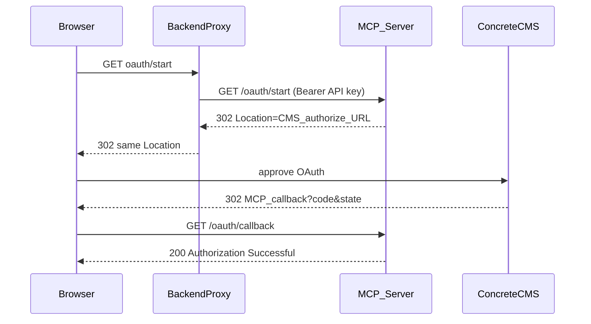

# Remote MCP Server Guide

Use remote mode when a remote MCP client needs to connect over HTTP instead of spawning a local stdio process. This is useful for hosted AI agents, CMS dashboards, and custom MCP clients.

You can also run HTTP mode on your local machine to test an AI agent before deploying — see **[Test HTTP mode locally](#test-http-mode-locally)**.

The server exposes a [Streamable HTTP](https://modelcontextprotocol.io/specification/2025-03-26/basic/transports) MCP endpoint and persistent OAuth routes.

For local stdio mode (Claude Desktop spawning the process), see the [main README](../README.md).

For building MCP clients and AI agents that call this server, see the **[MCP Client Developer Guide](mcp-client-guide.md)**.

## Client integration

Remote clients authenticate with `Authorization: Bearer <MCP_API_KEY>` and identify the CMS user with `X-Concrete-User-Id` on every `/mcp` request.

| Integration | Description |
|-------------|-------------|
| **Backend agent** | Your service calls `/mcp` and OAuth admin routes |
| **Web app proxy** | Your API forwards to `/mcp`; API key stays server-side |
| **CMS package** | Dashboard controller proxies to `/mcp` using session user ID |

See the **[MCP Client Developer Guide](mcp-client-guide.md)** for HTTP API details, OAuth flow, and implementation patterns.

For local stdio (Claude Desktop) or personal `mcp-remote` bridge setup, see the [main README](../README.md).

See the [Security Guide](security.md) for the full trust model.

## Environment variables

| Variable | Required | Default | Description |
|----------|----------|---------|-------------|
| `TRANSPORT_TYPE` | No | `stdio` | Set to `http` for remote mode |
| `PUBLIC_BASE_URL` | Yes (http mode) | — | Public URL of this server, e.g. `https://mcp.example.com` |
| `TOKEN_ENCRYPTION_KEY` | Yes (http mode) | — | AES-256-GCM encryption key for token files |
| `MCP_API_KEY` | Yes (http mode)* | — | Bearer token for MCP clients |
| `MCP_API_KEYS` | Alternative | — | JSON map of API keys to CMS user IDs (`null` = dynamic) |
| `PATH_PREFIX` | No | _(empty)_ | Path prefix for all routes, e.g. `/ccm-mcp` |
| `HTTP_HOST` | No | `0.0.0.0` | Bind address |
| `HTTP_PORT` | No | `3000` | Listen port |
| `TOKEN_DIR` | No | `~/.concretecms-mcp/tokens` | Base token directory; per-site subdirs are created automatically |
| `MCP_ENDPOINT_PATH` | No | `{PATH_PREFIX}/mcp` | Streamable HTTP MCP endpoint |
| `OAUTH_START_PATH` | No | `{PATH_PREFIX}/oauth/start` | OAuth initiation path |
| `OAUTH_CALLBACK_PATH` | No | `{PATH_PREFIX}/oauth/callback` | OAuth redirect path |
| `OAUTH_STATUS_PATH` | No | `{PATH_PREFIX}/oauth/status` | OAuth status path |
| `OAUTH_REVOKE_PATH` | No | `{PATH_PREFIX}/oauth/revoke` | Per-user token revocation |
| `HEALTH_PATH` | No | `{PATH_PREFIX}/health` | Health check path |

\* Either `MCP_API_KEY` or `MCP_API_KEYS` is required in http mode.

All `CONCRETE_*` variables from the [main README](../README.md) are still required. `CONCRETE_API_SCOPE` must include `account:read` so the server can resolve CMS user IDs after OAuth.

### Generate secrets

```bash
# Encryption key (TOKEN_ENCRYPTION_KEY)
node -e "console.log(require('crypto').randomBytes(32).toString('base64'))"

# MCP client API key (MCP_API_KEY)
node -e "console.log(require('crypto').randomBytes(32).toString('hex'))"
```

Store secrets in systemd `Environment=` directives or a root-only `0400` env file — not in a world-readable `.env` on production servers.

## Test HTTP mode locally

Before deploying to a remote server, you can run the same HTTP transport on your development machine to verify that your AI agent or MCP client connects correctly. No reverse proxy is required — the server listens directly on `127.0.0.1:3000` (or whatever you set in `HTTP_HOST` / `HTTP_PORT`).

### 1. Build the server

```bash
npm ci && npm run build
```

### 2. Register a local OAuth redirect URI

In your Concrete CMS API integration, add this redirect URI (it must match `${PUBLIC_BASE_URL}${OAUTH_CALLBACK_PATH}` exactly):

```
http://127.0.0.1:3000/oauth/callback
```

If you use a different `PUBLIC_BASE_URL`, `HTTP_PORT`, or `PATH_PREFIX`, adjust the URI accordingly. For example, with `PATH_PREFIX=/ccm-mcp` the callback is `http://127.0.0.1:3000/ccm-mcp/oauth/callback`.

### 3. Start the server

HTTP mode requires **four extra variables** beyond the `CONCRETE_*` settings from the [main README](../README.md): `TRANSPORT_TYPE=http`, `PUBLIC_BASE_URL`, `TOKEN_ENCRYPTION_KEY`, and `MCP_API_KEY`.

**Option A — single line (recommended for quick tests):**

```bash
TRANSPORT_TYPE=http \
PUBLIC_BASE_URL=http://127.0.0.1:3000 \
TOKEN_ENCRYPTION_KEY="$(node -e "console.log(require('crypto').randomBytes(32).toString('base64'))")" \
MCP_API_KEY="$(node -e "console.log(require('crypto').randomBytes(32).toString('hex'))")" \
CONCRETE_CANONICAL_URL=https://cms.example.com \
CONCRETE_API_CLIENT_ID=YOUR_API_CLIENT_ID \
CONCRETE_API_CLIENT_SECRET=YOUR_API_CLIENT_SECRET \
CONCRETE_API_SCOPE="account:read system:info:read" \
npm run start
```

**Option B — `.env` file (recommended for repeated local testing):**

```bash
cp .env.example .env
```

Edit `.env` for local HTTP mode:

```bash
TRANSPORT_TYPE=http
PUBLIC_BASE_URL=http://127.0.0.1:3000
HTTP_HOST=127.0.0.1
HTTP_PORT=3000
CONCRETE_CANONICAL_URL=https://cms.example.com
CONCRETE_API_CLIENT_ID=YOUR_API_CLIENT_ID
CONCRETE_API_CLIENT_SECRET=YOUR_API_CLIENT_SECRET
CONCRETE_API_SCOPE=account:read system:info:read
TOKEN_ENCRYPTION_KEY=your-base64-key
MCP_API_KEY=your-mcp-api-key
```

Load and start:

```bash
set -a && source .env && set +a && npm run start
```

> **Note:** The server does not load `.env` automatically. You must export the variables (as above) or pass them inline when starting.

### 4. Confirm HTTP mode started

Check the terminal output. A successful local HTTP start looks like:

```
[concretecms-mcp] Starting MCP server (http transport)...
[concretecms-mcp] Remote MCP server running at http://127.0.0.1:3000/mcp
[concretecms-mcp] OAuth start URL: http://127.0.0.1:3000/oauth/start
[concretecms-mcp] Remote MCP server ready. Authorize users via /oauth/start
```

If you see `(stdio transport)` instead, the server is **not** listening on HTTP and `http://127.0.0.1:3000/health` will not work. The most common cause is `TRANSPORT_TYPE=http` not being set — often due to a broken multiline shell command (see troubleshooting below).

### 5. Smoke-test endpoints

**Health check** (no authentication required):

```bash
curl http://127.0.0.1:3000/health
```

Expected response:

```json
{ "status": "healthy" }
```

**OAuth status** (requires API key):

```bash
curl -H "Authorization: Bearer $MCP_API_KEY" \
  "http://127.0.0.1:3000/oauth/status?user_id=42"
```

**Start OAuth for a user** (simulates a backend proxy — expect `state=` in `Location`):

```bash
curl -s -D - -o /dev/null -H "Authorization: Bearer $MCP_API_KEY" \
  "http://127.0.0.1:3000/oauth/start?user_id=42"
```

You can also run `npm run verify:oauth` to confirm the shipped `dist/` uses state-based session binding.

### 6. Connect your AI agent

Point your agent or MCP client at the local server:

```
MCP_SERVER_URL=http://127.0.0.1:3000
```

Send these headers on every `/mcp` request (see the **[MCP Client Developer Guide](mcp-client-guide.md)** for the full protocol):

```
Authorization: Bearer <MCP_API_KEY>
X-Concrete-User-Id: <cms_user_id>
```

Authorize the CMS user via `/oauth/start` before calling tools. Poll `/oauth/status?user_id=<id>` to confirm authentication.

### Troubleshooting local HTTP mode

| Symptom | Likely cause | Fix |
|---------|--------------|-----|
| `http://127.0.0.1:3000/health` connection refused | Server running in stdio mode (default) | Set `TRANSPORT_TYPE=http` and restart |
| Terminal shows `(stdio transport)` | `TRANSPORT_TYPE` not exported | Use the single-line command or `set -a && source .env` |
| `Missing required environment variable: TOKEN_ENCRYPTION_KEY` | HTTP secrets not set | Set `TOKEN_ENCRYPTION_KEY` and `MCP_API_KEY` |
| `zsh: command not found: I` (or similar) | Extra text on an env-var line | Each line must be only `VAR=value` — no trailing words |
| `TRANSPORT_TYPE` set but still stdio | `VAR=value other-command` syntax | `TOKEN_ENCRYPTION_KEY=xxx npm run start` sets the var only for that command; use `export` or `source .env` instead |
| Broken multiline command | Missing `\` at end of a line | Every continued line except the last must end with `\` |
| OAuth redirect mismatch | `PUBLIC_BASE_URL` differs from registered URI | Register `http://127.0.0.1:3000/oauth/callback` in CMS and match `PUBLIC_BASE_URL` |
| Port already in use | Another process on port 3000 | Change `HTTP_PORT` and update `PUBLIC_BASE_URL` accordingly |
| OAuth callback **400** — Invalid or expired OAuth session | Stale `dist/` (authorize URL missing `state`) or MCP restarted mid-flow | Run `npm run build`, restart **one** MCP process, verify `/oauth/start` `Location` includes `state=` |
| Authorize URL missing `state` | Running outdated `dist/` | `npm run build && npm run verify:oauth`, then restart |
| Callback 400 with `state` present | Client modified MCP `Location` URL, or multiple MCP processes | Forward `Location` unchanged; `lsof -nP -iTCP:3000 -sTCP:LISTEN` |
| `/oauth/start` 409 | Concurrent OAuth for same user | Wait or call `/oauth/revoke` |

## Concrete CMS OAuth setup

Register this redirect URI in your Concrete CMS API integration:

```
https://mcp.example.com/oauth/callback
```

Use the same value as `${PUBLIC_BASE_URL}${OAUTH_CALLBACK_PATH}`.

## Per-user authorization (http mode)

Each CMS user must authorize separately. API calls use the token for the user specified by `X-Concrete-User-Id`.

### Authorize a user

```bash
# Obtain redirect URL (open Location in browser) — use GET, not HEAD
curl -s -D - -o /dev/null -H "Authorization: Bearer $MCP_API_KEY" \
  "https://mcp.example.com/oauth/start?user_id=42"
```

Sign in to CMS as that user and approve scopes. Tokens are saved on the server as `{userId}.tokens.json` and `{userId}.client.json` under `TOKEN_DIR/<siteKey>/` (derived from `CONCRETE_CANONICAL_URL`).

If another OAuth flow is already running for that user, `/oauth/start` returns `409`.

### Proxied OAuth (backend clients)

Most HTTP clients — including Concrete CMS packages, web app backends, and agent services — should **not** send the browser directly to MCP `/oauth/start`. The API key stays server-side; the backend proxies the start request.



1. **Backend** calls `GET /oauth/start?user_id=N` with `Authorization: Bearer <MCP_API_KEY>`.
2. MCP returns **`302`** with `Location:` pointing to the CMS authorize URL. The URL includes **`state=`**, **`code_challenge=`**, `client_id`, and `redirect_uri`.
3. Backend redirects the **browser** to that `Location` URL **unchanged** (do not rebuild or strip query parameters).
4. User approves on Concrete CMS. CMS echoes the same `state` on callback.
5. Browser hits `{PUBLIC_BASE_URL}/oauth/callback?code=...&state=...`. MCP looks up the in-memory session by `state` and exchanges the code.

The browser does **not** need an MCP-host cookie. Session binding uses standard OAuth `state`, not `Set-Cookie`.

> **Important:** `npm run start` runs `dist/index.js`. After editing `src/`, run `npm run build` (or rely on the `prestart` hook) so `dist/` matches `src/`. A stale `dist/` build that omits `state` from authorize URLs will cause callback **400 Invalid or expired OAuth session** for proxied clients.

See the **[MCP Client Developer Guide](mcp-client-guide.md)** for web application and CMS package patterns.

### Check status

```bash
curl -H "Authorization: Bearer $MCP_API_KEY" \
  "https://mcp.example.com/oauth/status?user_id=42"
```

```json
{ "userId": 42, "authenticated": true, "expiresAt": 1710000000000 }
```

### Revoke a user

```bash
curl -X POST -H "Authorization: Bearer $MCP_API_KEY" \
  "https://mcp.example.com/oauth/revoke?user_id=42"
```

## Hosting options

### Dedicated subdomain (default)

Run the MCP server on its own hostname, for example `mcp.example.com`, pointing at your Concrete CMS site `cms.example.com`. Leave `PATH_PREFIX` unset.

- MCP endpoint: `https://mcp.example.com/mcp`
- OAuth start: `https://mcp.example.com/oauth/start`
- OAuth callback: `https://mcp.example.com/oauth/callback`

### Same domain with a path prefix

You can also run the MCP server on the same domain as Concrete CMS by setting a path prefix. This avoids conflicts with CMS routes such as `/oauth/2.0/authorize`.

```bash
TRANSPORT_TYPE=http
PUBLIC_BASE_URL=https://cms.example.com
PATH_PREFIX=/ccm-mcp
CONCRETE_CANONICAL_URL=https://cms.example.com
```

With `PATH_PREFIX=/ccm-mcp`, the routes become:

- MCP endpoint: `https://cms.example.com/ccm-mcp/mcp`
- OAuth start: `https://cms.example.com/ccm-mcp/oauth/start`
- OAuth callback: `https://cms.example.com/ccm-mcp/oauth/callback`

Register the callback URL in your Concrete CMS API integration:

```
https://cms.example.com/ccm-mcp/oauth/callback
```

Individual path env vars (`MCP_ENDPOINT_PATH`, `OAUTH_START_PATH`, etc.) can override the defaults if needed.

When sharing a domain with Concrete CMS, do not proxy the entire `/oauth/` prefix to the MCP server, because CMS uses `/oauth/2.0/*` for its own OAuth endpoints.

## Deploy on Linux with systemd

For production, running the MCP server as a **systemd service** is a simple and reliable approach. The server listens on port 3000 locally; place a reverse proxy in front for public access.

### 1. Install Node.js 20+

Install Node.js 20 or later using your platform's recommended method. See the [Node.js download page](https://nodejs.org/en/download) for official packages and instructions.

Verify the installation:

```bash
node -v
npm -v
```

### 2. Clone and build

Choose an installation directory on your server, for example `/opt/concretecms-mcp`:

```bash
sudo mkdir -p /opt/concretecms-mcp
sudo chown mcp:mcp /opt/concretecms-mcp
cd /opt/concretecms-mcp
git clone https://github.com/MacareuxDigital/concretecms-mcp-server.git .
npm ci && npm run build
```

### 3. Configure environment

Create a secrets file readable only by the service user:

```bash
sudo install -o mcp -g mcp -m 0400 /dev/null /etc/concretecms-mcp.env
sudo vi /etc/concretecms-mcp.env
```

Example:

```bash
PUBLIC_BASE_URL=https://mcp.example.com
CONCRETE_CANONICAL_URL=https://cms.example.com
CONCRETE_API_CLIENT_ID=YOUR_API_CLIENT_ID
CONCRETE_API_CLIENT_SECRET=YOUR_API_CLIENT_SECRET
CONCRETE_API_SCOPE=account:read system:info:read
HTTP_PORT=3000
TOKEN_ENCRYPTION_KEY=your-base64-key
MCP_API_KEY=your-mcp-api-key
TOKEN_DIR=/var/lib/concretecms-mcp/tokens
```

```bash
sudo mkdir -p /var/lib/concretecms-mcp/tokens
sudo chown mcp:mcp /var/lib/concretecms-mcp/tokens
sudo chmod 700 /var/lib/concretecms-mcp/tokens
```

### 4. Create a systemd service

```bash
sudo vi /etc/systemd/system/concretecms-mcp.service
```

```ini
[Unit]
Description=Concrete CMS MCP Server
After=network.target

[Service]
Type=simple
User=mcp
Group=mcp
WorkingDirectory=/opt/concretecms-mcp
EnvironmentFile=/etc/concretecms-mcp.env
Environment=TRANSPORT_TYPE=http
Environment=HTTP_HOST=0.0.0.0
Environment=HTTP_PORT=3000
ExecStart=/usr/bin/node dist/index.js
Restart=on-failure
RestartSec=5
NoNewPrivileges=true

[Install]
WantedBy=multi-user.target
```

Replace paths and `ExecStart` with values that match your server. Confirm the Node.js path with `which node`.

Enable and start:

```bash
sudo systemctl daemon-reload
sudo systemctl enable concretecms-mcp
sudo systemctl start concretecms-mcp
sudo systemctl status concretecms-mcp
```

Useful commands:

```bash
sudo systemctl restart concretecms-mcp
sudo journalctl -u concretecms-mcp -f
sudo systemctl reset-failed concretecms-mcp
```

After deploying code changes:

```bash
cd /opt/concretecms-mcp
git pull
npm run build
sudo systemctl restart concretecms-mcp
```

### 5. Reverse proxy

Expose the service through your reverse proxy. The examples below use nginx, but the same routes can be configured on Apache, Caddy, or another proxy.

Consider `limit_req` on OAuth routes as defense-in-depth:

```nginx
limit_req_zone $binary_remote_addr zone=mcp_oauth:10m rate=10r/m;
```

#### Dedicated subdomain

```nginx
location /mcp {
    proxy_pass http://127.0.0.1:3000;
    proxy_http_version 1.1;
    proxy_set_header Host $host;
    proxy_set_header X-Forwarded-Proto $scheme;
    proxy_buffering off;
}

location = /oauth/start {
    limit_req zone=mcp_oauth burst=5 nodelay;
    proxy_pass http://127.0.0.1:3000;
    proxy_set_header Host $host;
    proxy_set_header X-Forwarded-Proto $scheme;
}

location = /oauth/callback {
    limit_req zone=mcp_oauth burst=5 nodelay;
    proxy_pass http://127.0.0.1:3000;
    proxy_set_header Host $host;
    proxy_set_header X-Forwarded-Proto $scheme;
}

location = /oauth/status {
    proxy_pass http://127.0.0.1:3000;
    proxy_set_header Host $host;
}

location = /oauth/revoke {
    proxy_pass http://127.0.0.1:3000;
    proxy_set_header Host $host;
}

location = /health {
    proxy_pass http://127.0.0.1:3000;
    proxy_set_header Host $host;
}
```

#### Same domain with `PATH_PREFIX=/ccm-mcp`

```nginx
location /ccm-mcp/mcp {
    proxy_pass http://127.0.0.1:3000;
    proxy_http_version 1.1;
    proxy_set_header Host $host;
    proxy_buffering off;
}

location /ccm-mcp/oauth/ {
    proxy_pass http://127.0.0.1:3000;
}

location /ccm-mcp/health {
    proxy_pass http://127.0.0.1:3000;
}
```

Reload your proxy after changing the configuration.

## Connect a remote MCP client

See the **[MCP Client Developer Guide](mcp-client-guide.md)** for the full HTTP API reference, per-user OAuth flow, agent loops, and implementation patterns (backend service, web app proxy, CMS package).

Quick reference — send on every `/mcp` request:

```
Authorization: Bearer <MCP_API_KEY>
X-Concrete-User-Id: <cms_user_id>
```

Poll `/oauth/status?user_id=<id>` before enabling AI for a user. Trigger `GET /oauth/start?user_id=<id>` when not authenticated.

For Claude Desktop or `mcp-remote` personal bridge setup, see the [main README](../README.md).

## Docker deployment (alternative)

If you prefer containers over systemd:

```bash
cp .env.example .env
# edit .env — set TOKEN_ENCRYPTION_KEY and MCP_API_KEY
docker compose up -d --build
```

`TRANSPORT_TYPE=http` is set in `docker-compose.yml`. Tokens are persisted in the `mcp-tokens` Docker volume.

## Security

See the **[Security Guide](security.md)** for encryption, file permissions, trust model, and token revocation.
